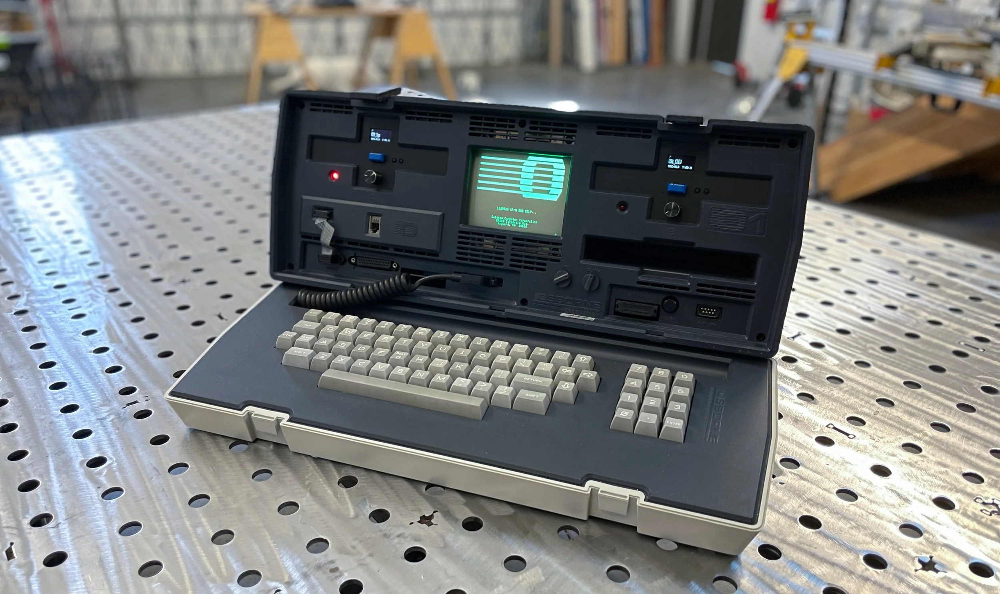
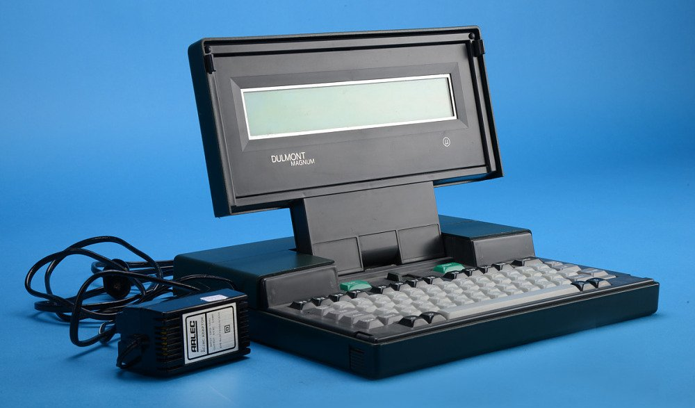
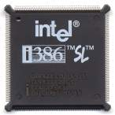
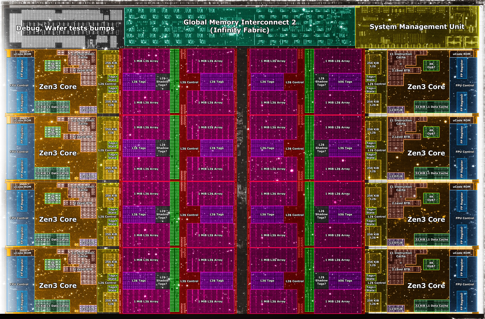
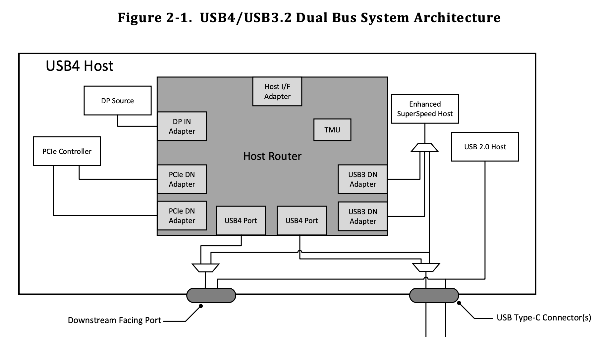
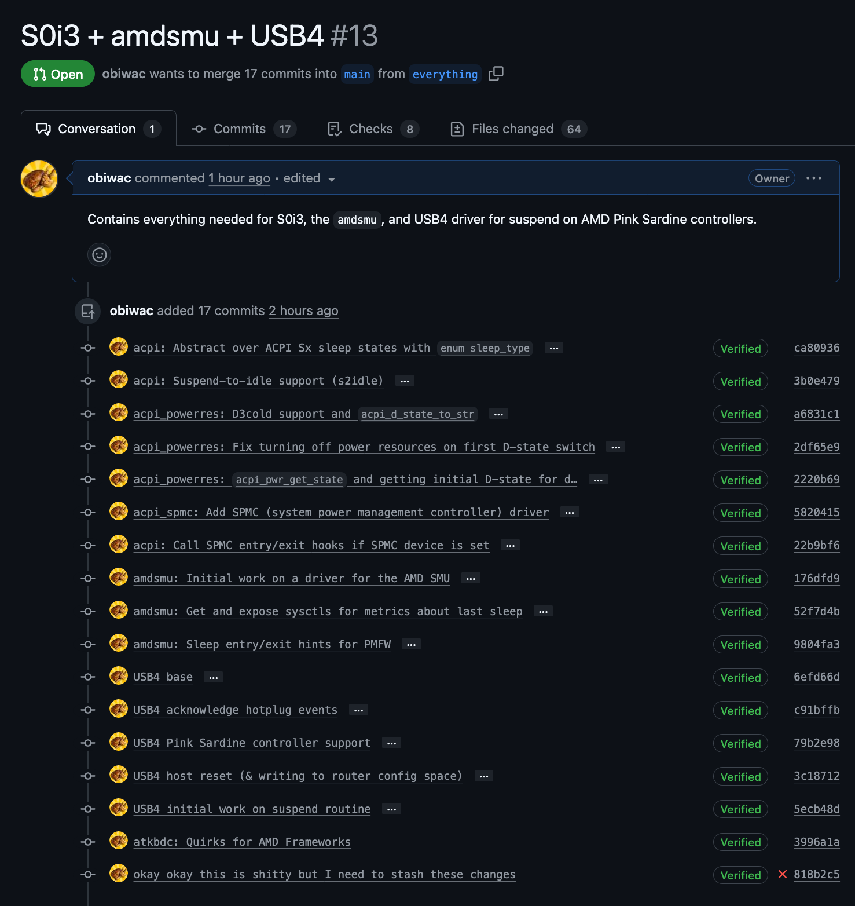

<style>
	@import url('https://fonts.googleapis.com/css2?family=Dosis:wght@200..800&family=Gloria+Hallelujah&family=IBM+Plex+Mono:ital,wght@0,100;0,200;0,300;0,400;0,500;0,600;0,700;1,100;1,200;1,300;1,400;1,500;1,600;1,700&display=swap');

	:root {
		/* --color-background-code: #000000aa; */
		--color-background-code: #ffffff82;
		--color-foreground: #003;
	}

	section {
		background-color: #025;
		background-image: url('bg.jpg');
		background-position: center bottom;
		background-size: cover;
		/* text-shadow: 0px 3px 8px #0005; */
	}

	h1, h2 {
		font-family: "Gloria Hallelujah";
	}

	a {
		color: #ff008f;
	}

	h1 {
		font-size: 1.5em;
	}

	h2 {
		font-size: 1.3em;
	}

	p, li {
		font-family: "Dosis";
		font-size: 0.8em;
		font-weight: 600;
	}

	code {
		font-family: "IBM Plex Mono";
		font-size: 0.7em;
		border-radius: 0.4em;
		background: red; /* TODO This don't work. */
	}

	marp-pre {
		filter: none;
	}

	marp-pre code {
		font-size: 1em;
	}

	kbd {
		font-size: 0.7em;
		line-height: 1.2em;
	}

	.hljs-string { color: #02a2ff; }
	.hljs-keyword, .hljs-type { color: #eb00ff; }
	.hljs-number, .hljs-literal { color: #02a2ff; }
	.hljs-built_in { color: #004297; }
	.hljs-comment { color: #c48dbe; }
</style>


---

## About me


- OSs and graphics programming
- Sponsored by the FreeBSD Foundation to work on this
- Developer at Klara (FreeBSD stuff)
- *REALLY* like trains 🚂🚃🚄🚅🚆🚉🛤️

---



---



---

## ✨ Suspend-to-RAM ✨

---

## ✨ Suspend-to-RAM ✨

- Almost everything off except for RAM
- Cool!
- Bad cuz still have to refresh RAM, and actually costs more power the more RAM you have

---

## Intel 386SL & SMM



- Code at SMBASE, run in SMM
- SMI to switch over
- Initiated by firmware (ew) or OS
- Super bad

---

## APM


- Power events to OS
- OS initiates all suspend transitions (BIOS interrupt)
- Standard!

---

## ACPI

- Idea of OSPM
- Multiple global states, like S0 (active) and S5 (off)
- S3 for suspend-to-RAM

---

## ACPI

- Cool, but still problematic
- High entry/exit latency, firmware still doing a lot of heavy-lifting
- Can't really interrupt this cheaply (e.g. wake on packet)

---

## S0ix 🚀

- Global state stays S0
- Platform decides when to enter S0ix state and turn off CPU
- In theory, we "just" need to meet some device power constraints and idle the CPU
- The holy grail is S0i3 (saves the most power)

---

## Suspend-to-idle (s2idle) 💤

- Stop OS from doing work
- Idle CPUs

---

## Suspend-to-idle (s2idle) 💤

- First step, bind ourselves to CPU 0 and stop all scheduler clocks
- Then, kick all CPUs so they enter idle state

```c
sched_bind(curthread, 0); // Bind ourselves to CPU 0.
suspendclock(); // Stop scheduler clock - CPUs will enter idle state.

// Kick all other CPUs to enter idle state.

cpuset_t others = all_cpus;
CPU_CLR(curcpu, &others);
ipi_selected(IPI_SWI, &others);
```

---

## Suspend-to-idle (s2idle) 💤

- Since we wake from idle on interrupt, we should disable all interrupts except for wake interrupts
- When the firmware has something to say, it sends a GPE (general purpose event) by triggering an SCI (system control interrupt)
- So, enable SCIs (interrupt 9 usually)

```c
register_t rflags = intr_disable(); // Save previous IF, run x86 cli.
intr_suspend(); // Stop interrupts from all PICs.
intr_enable_src(AcpiGbl_FADT.SciInterrupt); // Enable SCIs (interrupt 9).
```

---

## Suspend-to-idle (s2idle) 💤

- Actually idle the CPU, in an "s2idle loop" cuz platform will send us "spurious" GPEs (to update battery status e.g.), which will exit `cpu_idle`
- GPE handler added to taskqueue, so wait for that before reading `not_wake_event`

```c
while (not_wake_event) {
	cpu_idle(0); // busy = 1 will just enter C1, which I'll go over later.
	taskqueue_quiesce(acpi_taskq); // Wait for GPE to be handled.
}
```

- Not final design, maybe best to special-case this and run synchronously
- Also should pin handler to CPU 0 to avoid waking other CPUs, but this breaks other things

<!--
not_wake_event is just an example, not real.
Explain that not_wake_event would be set by opening the lid, pressing the power button, etc. but not those battery update events of course.
-->

---

## Suspend-to-idle (s2idle) 💤

- Once we exit from s2idle loop, resume interrupts and resume scheduler clocks

```c
intr_resume(false); // Resume interrupts on all PICs.
intr_restore(rflags); // Restore IF.

resumeclock(); // Resume scheduler clock.
```

---

## Crash course on ACPI 💥

---

## Crash course on ACPI 💥

- Platform exposes a bunch of information about hardware configuration through **AML** (ACPI machine language)
- Methods for telling devices what to do
- E.g., decompiled AML (== ASL) for lid device (`acpi_lid`):

```c
// Can decompile system's AML with: acpidump -dt
Device (_LID0) {
	Name (_HID, EisaId ("PNP0C0D") /* Lid Device */) // _HID: Hardware ID
	/* ... */
	Method (_LID, 0, NotSerialized) { // _LID: Lid Status
		Return (ESWL) // \_SB_.ESWL, see 19.6.47 in ACPI spec.
	}
}
```

<!--
Explain what the lid device is (open/close laptop).
Explain that the ID is used when probing for lid devices.
ESWL is just a field in NVRAM which is set when the lid opens/closes.
Motivate this (the nice thing is that this abstracts away the exact address of this value).
-->

---

## Crash course on ACPI 💥

```c
/*
 * Evaluate _LID and check the return value, update lid status.
 *	Zero:		The lid is closed
 *	Non-zero:	The lid is open
 */
status = acpi_GetInteger(sc->lid_handle, "_LID", &lid_status);
if (ACPI_FAILURE(status))
	lid_status = 1;		/* assume lid is opened */
else
	lid_status = (lid_status != 0); /* range check value */
```

From `sys/dev/acpica/acpi_lid.c`.

---

## SPMC (System Power Management Controller) 👮‍♀️

---

## SPMC (System Power Management Controller) 👮‍♀️

- Need to let platform know we're suspending before s2idle
- Need to let platform know we're resuming after s2idle

---

## SPMC (System Power Management Controller) 👮‍♀️

- Device specific method (`_DSM`): multiplexed vendor-defined function, `Arg0` is vendor-specific UUID:
	- `Arg2 = GET_DEVICE_CONSTRAINTS`: For each device, shallowest acceptable power state (min D-state). **If a device violates its constraints, the system will not enter an LPI state!** (In theory.)
	- `Arg2 = DISPLAY_OFF_NOTIF, ENTRY_NOTIF`: Tell FW we are entering modern standby
	- `Arg2 = EXIT_NOTIF, DISPLAY_ON_NOTIF`: Tell FW we are exiting modern standby
- Vendor-specific complications

---

## SPMC (System Power Management Controller) 👮‍♀️

- Let the platform (embedded controller) know that we're supposed to be sleeping
- Will respond by fading power button LED in/out (`zephyr/program/framework/src/led.c` on Framework)
- Also reduces the frequency of some GPEs that we can't disable and that would wake us too often otherwise

<!--
Explain we can't disable these GPEs cuz they are under the same GPE number as important wake GPEs.
-->

---

## D-states 🔌

- Device power state
- D0 (on), D1, D2, D3-ish (off)
- D3 split into D3hot 🔥 (off but with power) & D3cold ❄️ (off with no power).
- To get/set the D-state of a device: **power resources**

---

## D-states 🔌

- Put everything in D3
- Except wake devices
- But still need to respect SPMC constraints

---

## Power resources ⚡

---

## Power resources ⚡

Won't talk about this

---

## C-states 🌊

- Need all CPUs to be in a low power idle state (C-state)
- C0 (active), C1 (`hlt`), C2, C3, maybe &

---

## C-states 🌊

- In theory, just use x86 `MWAIT` instruction, similar to `HLT`
- Used in conjunction with `MONITOR`
- Can be used to idle CPU until next interrupt:

```x86asm
; ...
mov eax, 0x30 ; C-state C4 (MWAIT_C4).
mov ecx, 1    ; Break on interrupt, like hlt (MWAIT_INTRBREAK).
mwait
```

---

## C-states 🌊

- But different entry methods, defined by `_CST` object
- AMD relies on reading a byte somewhere in memory (`P_LVL{2,3}` registers)

```c
Name (_CST Package (0x04) {
	0x03, // C-state count.
	Package (0x04) { // C1
		ResourceTemplate () { Register (FFixedHW, 0x02, 0x02, 0x0000000000000000) }
		0x01, // C-state type: C1.
		0x0001, // Entry/exit latency (us).
		0x00000000, // Power consumption (mW).
	},
	// ...
	Package (0x04) { // C3
		ResourceTemplate () { Register (SystemIO, 0x08, 0x00, 0x0000000000000414, 0x01) }
		0x03, // C-state type: C3.
		0x015E, // Entry/exit latency (us).
		0x00000000, // Power consumption (mW).
	}
})
```

---

## C-states 🌊

- `_LPI` supersedes `_CST`, essentially contains the same information as `_CST`
- Can contain an optional residency counter (unused on AMD):

> The register is **optional**. If the platform does not support it, then the following NULL register descriptor should be used: `ResourceTemplate() {Register {(SystemMemory, 0, 0, 0, 0)}}`.

---

## C-states 🌊

- `_LPI` example for C3:

```c
Package (0x0A) { // C3
	0x000002BC, // Minimum residency (us) - this state becomes more power efficient than any C < 3 after this time.
	0x0000015E, // Worst exit latency (us).
	0x00000001, // Flags: 1 = enabled, 0 = disabled.
	0x00000000,
	0x00000000, // Residency counter frequency (Hz).
	0x00000001,
	ResourceTemplate () { // Entry method (same as in _CST).
		Register (SystemIO, 0x08, 0x00, 0x0000000000000415, 0x01)
	},
	ResourceTemplate () { // Residency counter register (optional).
		Register (SystemMemory, 0x00, 0x00, 0x0000000000000000)
	},
	ResourceTemplate () { // Usage counter register (optional).
		Register (SystemMemory, 0x00, 0x00, 0x0000000000000000)
	},
	"C3", // Name.
}
```

---

## C-states 🌊

- All this is in `sys/dev/acpica/acpi_cpu.c`
- For some reason (probably related to S3 entry), `disable_idle()` called in `acpi_cpu_suspend`
- This disables C-state entry, so we have to like not do this when entering S0i3

<!--
Say I still need to look deeper into why acpi_idle not used.
-->

---

## In practice

- That's all we need to do in theory
- In practice, there's a lot of vendor-specific stuff

---

## AMD SMU 🪲



- System Management Unit
- Runs PMFW, which is AMD's power management FW, which actually decides when we enter S0i3
- Can send commands to it to get residency stats & hint we're entering/exiting sleep

---

## AMD SMU: Debugging 🪲

- `amdsmu` driver creates `sysctl`s to read residency stats from SMU and IP blocks blocking from sleeping:

```console
% sysctl dev.amdsmu.0
dev.amdsmu.0.metrics.total_time_in_sw_drips: 0
dev.amdsmu.0.metrics.time_last_in_sw_drips: 0
dev.amdsmu.0.metrics.total_time_in_s0i3: 0
dev.amdsmu.0.metrics.time_last_in_s0i3: 0
...
dev.amdsmu.0.metrics.s0i3_last_entry_status: 0
dev.amdsmu.0.metrics.hint_count: 0
...
dev.amdsmu.0.ip_blocks.USB4_0.last_time: 6442461721
dev.amdsmu.0.ip_blocks.USB4_0.active: 1
...
dev.amdsmu.0.ip_blocks.USB3_1.last_time: 0
dev.amdsmu.0.ip_blocks.USB3_1.active: 1
dev.amdsmu.0.ip_blocks.USB3_0.last_time: 0
dev.amdsmu.0.ip_blocks.USB3_0.active: 1
...
dev.amdsmu.0.ip_blocks.CPU.last_time: 0
dev.amdsmu.0.ip_blocks.CPU.active: 0
dev.amdsmu.0.ip_blocks.DISPLAY.last_time: 0
dev.amdsmu.0.ip_blocks.DISPLAY.active: 1
dev.amdsmu.0.version_revision: 0
dev.amdsmu.0.version_minor: 87
dev.amdsmu.0.version_major: 76
...                                                                                                                         
```

---

## AMD SMU: Debugging 🪲

- If we fail to enter C3, `amdsmu` shows us the CPU is still active and we're not entering S0i3:

```console
% sysctl dev.amdsmu.0
dev.amdsmu.0.metrics.total_time_in_sw_drips: 10997016
dev.amdsmu.0.metrics.time_last_in_sw_drips: 10997016
dev.amdsmu.0.metrics.total_time_in_s0i3: 0
dev.amdsmu.0.metrics.time_last_in_s0i3: 0
...
dev.amdsmu.0.metrics.s0i3_last_entry_status: 0
dev.amdsmu.0.metrics.hint_count: 1
...
dev.amdsmu.0.ip_blocks.USB4_0.last_time: 6442461721
dev.amdsmu.0.ip_blocks.USB4_0.active: 1
...
dev.amdsmu.0.ip_blocks.USB3_1.last_time: 10997016
dev.amdsmu.0.ip_blocks.USB3_1.active: 1
dev.amdsmu.0.ip_blocks.USB3_0.last_time: 10997016
dev.amdsmu.0.ip_blocks.USB3_0.active: 1
...
dev.amdsmu.0.ip_blocks.CPU.last_time: 10997016
dev.amdsmu.0.ip_blocks.CPU.active: 0
dev.amdsmu.0.ip_blocks.DISPLAY.last_time: 0
dev.amdsmu.0.ip_blocks.DISPLAY.active: 1
dev.amdsmu.0.version_revision: 0
dev.amdsmu.0.version_minor: 87
dev.amdsmu.0.version_major: 76
...                                                                                                                         
```

## Debugging: AMD SMU 🪲

- Now the SMU tells us the following:

```
% sysctl dev.amdsmu.0
dev.amdsmu.0.metrics.total_time_in_sw_drips: 24976257
dev.amdsmu.0.metrics.time_last_in_sw_drips: 24976257
dev.amdsmu.0.metrics.total_time_in_s0i3: 0
dev.amdsmu.0.metrics.time_last_in_s0i3: 0
...
dev.amdsmu.0.metrics.s0i3_last_entry_status: 0
dev.amdsmu.0.metrics.hint_count: 1
...
dev.amdsmu.0.ip_blocks.USB4_0.last_time: 6442461721
dev.amdsmu.0.ip_blocks.USB4_0.active: 1
...
dev.amdsmu.0.ip_blocks.USB3_1.last_time: 24976257
dev.amdsmu.0.ip_blocks.USB3_1.active: 1
dev.amdsmu.0.ip_blocks.USB3_0.last_time: 24976257
dev.amdsmu.0.ip_blocks.USB3_0.active: 1
...
dev.amdsmu.0.ip_blocks.CPU.last_time: 0
dev.amdsmu.0.ip_blocks.CPU.active: 0
dev.amdsmu.0.ip_blocks.DISPLAY.last_time: 0
dev.amdsmu.0.ip_blocks.DISPLAY.active: 1
dev.amdsmu.0.version_revision: 0
dev.amdsmu.0.version_minor: 87
dev.amdsmu.0.version_major: 76
...                                                                                                                         
```

- Still not entering S0i3 because of USB4! 😡😡😡💃😡

---

## USB4 🌈

Quick overview

---



---

## USB4 🌈

- USB 2.0 over own differential pair pins in connector (D+/-)
- USB 3.2 either tunneled through router, either directly to TX/RX differential pair pins (non-USB4 mode)
- DisplayPort either tunneled through router, or DP Alt mode
- PCIe tunneled over USB4:


<!--
DP Alt Mode uses TX/RX diff. pairs, sideband pins used for link management/config.
-->

---

## USB4 🌈

- ICM: internal connection manager implemented in firmware, old irrelevant chips
- HCM: host connection manager, OS-side
- Pre-OS connection manager that BIOS uses, so must be able to sleep router from OS
- Tried passing USB4 to Linux guest to suspend -> didn't work lol
- Scott Long did initial USB4 work for FreeBSD and was transferred to HPS (may he RIP)

---

## USB4 🌈

- Most important thing for our purposes is simply getting the router to sleep
- Link states: CL0 (link active), CL1, CLd (deep power saving)
- All we need to do is fairly straightforward, we tell router to enter sleep by setting the `SLP` bit in `ROUTER_CS5`
- Then we wait for `SLPR` (sleep ready) bit to be set in `ROUTER_CS6` (or `ROP_CMPLT` notification on v2)

---

## AMD SMU: Debugging 🪲

- Now the SMU tells us the following:

```
% sysctl dev.amdsmu.0
dev.amdsmu.0.metrics.total_time_in_sw_drips: 23681759
dev.amdsmu.0.metrics.time_last_in_sw_drips: 23681759
dev.amdsmu.0.metrics.total_time_in_s0i3: 22169006
dev.amdsmu.0.metrics.time_last_in_s0i3: 22169006
...
dev.amdsmu.0.metrics.s0i3_last_entry_status: 1
dev.amdsmu.0.metrics.hint_count: 1
...
dev.amdsmu.0.ip_blocks.USB4_0.last_time: 6442461721
dev.amdsmu.0.ip_blocks.USB4_0.active: 1
...
dev.amdsmu.0.ip_blocks.USB3_1.last_time: 0
dev.amdsmu.0.ip_blocks.USB3_1.active: 1
dev.amdsmu.0.ip_blocks.USB3_0.last_time: 0
dev.amdsmu.0.ip_blocks.USB3_0.active: 1
...
dev.amdsmu.0.ip_blocks.CPU.last_time: 0
dev.amdsmu.0.ip_blocks.CPU.active: 0
dev.amdsmu.0.version_revision: 0
dev.amdsmu.0.version_minor: 87
dev.amdsmu.0.version_major: 76
...                                                                                                                         
```

- S0i3!!! 🎉🎊

---

## USB4 🌈

- During development it helped a lot to get a minimal Linux kernel with just enough to enter S0i3 to test exactly what I needed to implement in USB4 for S0i3.
- The `amd_s2idle.py` script by Mario Limonciello (AMD) was very helpful in debugging this, and he helped me out a lot too, so thank you 🫡

---

## What's left??

- Stuff locks up and breaks down after resume
- Narrowed this down to NVMe resuming (thanks Mark!)
- NVMe is powered off explicitly by EC:

```c
static int chipset_prepare_S3(uint8_t enable)                                                                                                           
{
	if (!enable) {
		gpio_pin_set_dt(GPIO_DT_FROM_NODELABEL(gpio_sys_pwrgd_ec), 0);
		gpio_pin_set_dt(GPIO_DT_FROM_NODELABEL(gpio_vr_on), 0);
		k_msleep(85);
		gpio_pin_set_dt(GPIO_DT_FROM_NODELABEL(gpio_susp_l), 0);
		gpio_pin_set_dt(GPIO_DT_FROM_NODELABEL(gpio_0p75vs_pwr_en), 0);
		gpio_pin_set_dt(GPIO_DT_FROM_NODELABEL(gpio_ssd_pwr_en), 0);
	} else {
		gpio_pin_set_dt(GPIO_DT_FROM_NODELABEL(gpio_susp_l), 1);
		gpio_pin_set_dt(GPIO_DT_FROM_NODELABEL(gpio_0p75vs_pwr_en), 1);
		k_msleep(20);
		gpio_pin_set_dt(GPIO_DT_FROM_NODELABEL(gpio_vr_on), 1);
		gpio_pin_set_dt(GPIO_DT_FROM_NODELABEL(gpio_ssd_pwr_en), 1);

		/* wait VR power good */
		if (power_wait_signals(IN_VR_PGOOD)) {
			/* something wrong, turn off power and force to g3 */
			power_chipset_init();
		}

		k_msleep(10);
		gpio_pin_set_dt(GPIO_DT_FROM_NODELABEL(gpio_sys_pwrgd_ec), 1);
	}

	return true;
}
```

---

## Testing 🧪

- Most stuff has been committed
- Have a few extra commits for more platform support in a branch: [obiwac/freebsd-s0ix#15](https://github.com/obiwac/freebsd-s0ix/pull/15)



---

## Testing 🧪

- Please test on your machine 🙏🙏
- Make sure you have s2idle:

```console
% sysctl hw.acpi.supported_sleep_state
hw.acpi.supported_sleep_state: S4 S5 s2idle
```

- `sysctl hw.acpi.power_button_state=s2idle`, then press power button.
- Send `dmesg` after suspending
- Also send `acpidump -dt` (decompiled AML)
- Also also send `sysctl dev.amdsmu.0` (if AMD - make sure you `kldload amdsmu` beforehand!)

---

## Future 🔮

- Intel!
- Give users the ability to define more complex wake rules
- Hibernate (S4, suspend to disk) after suspended to memory for a certain amount of time

---

## FreeBSD Foundation laptop project 💻

Public issue tracker for all things FreeBSD laptop related:

<https://github.com/FreeBSDFoundation/proj-laptop/issues>

Please, do test this on your laptops and send me an email if something isn't working quite right!


---

## Contact ☎️

- Have a beer (or 12)! 🍻
- FreeBSD email: [obiwac@freebsd.org](mailto:obiwac@freebsd.org)
- Regular email: [me@obiw.ac](mailto:me@obiw.ac)
- Website: <https://obiw.ac>
- GitHub: <https://github.com/obiwac>
- Discord: **@obiwac** (Not incredibly active, prefer email.)


---

## ✨ Demo ✨

1/3 chance of failing!

<!--
REMEMBER TO UNPLUG FROM AC!!!

just identified an issue with USB4 panicking right before this presentation and now its working but with a really gross hack... explain

sysctl dev.amdsmu.0
sysctl hw.acpi.supported_sleep_state
sysctl hw.acpi.power_button_state=s2idle

... sleep

sysctl dev.amdsmu.0

Have some jokes ready on a piece of paper if this fails.
Show jokes paper anyway if it succeeds.
-->
