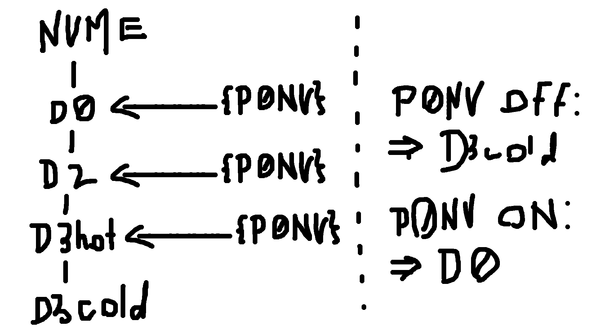
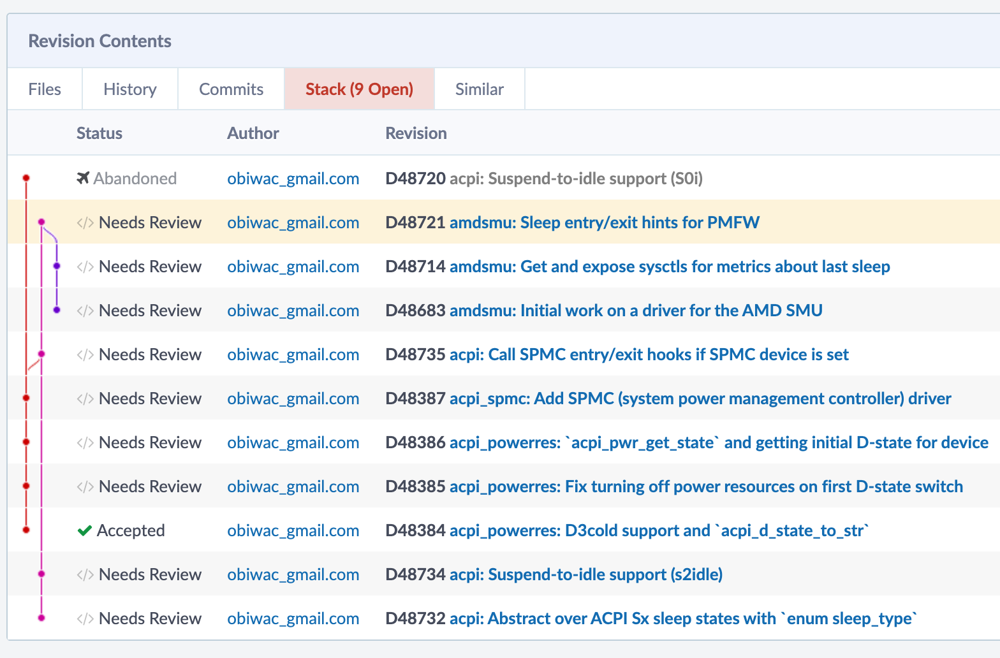
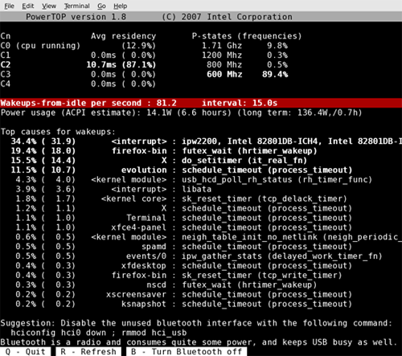

<style>
	@import url('https://fonts.googleapis.com/css2?family=Dosis:wght@200..800&family=Gloria+Hallelujah&family=IBM+Plex+Mono:ital,wght@0,100;0,200;0,300;0,400;0,500;0,600;0,700;1,100;1,200;1,300;1,400;1,500;1,600;1,700&display=swap');

	:root {
		/* --color-background-code: #000000aa; */
		--color-background-code: #20202082;
		--color-foreground: #ffc;
	}

	section {
		background-color: #025;
		/* TODO Could use this as a background and have a light theme?
		https://www.shutterstock.com/image-vector/holographic-texture-rainbow-foil-iridescent-600nw-1903129537.jpg */
		background-image: url('bg.png');
		background-position: center bottom;
		text-shadow: 0px 3px 8px #0005;
	}

	h1, h2 {
		font-family: "Gloria Hallelujah";
	}

	h1 {
		font-size: 1.5em;
	}

	h2 {
		font-size: 1.3em;
	}

	p, li {
		font-family: "Dosis";
		font-size: 0.8em;
		font-weight: 600;
	}

	code {
		font-family: "IBM Plex Mono";
		font-size: 0.7em;
		border-radius: 0.4em;
		background: red; /* TODO This don't work. */
	}

	marp-pre code {
		font-size: 1em;
	}

	kbd {
		font-size: 0.7em;
		line-height: 1.2em;
	}

	.hljs-string { color: #c6eaff; }
	.hljs-keyword, .hljs-type { color: #ffc6f1; }
	.hljs-number, .hljs-literal { color: #c6eaff; }
	.hljs-built_in { color: #fff1c6; }
	.hljs-comment { color: #a2a08e; }
</style>

<!-- Should I just have this on the main page, and use the left page for the title page? The font is Caenannas. -->


---

## About me

<!-- or maybe picture of me? -->


- OSs and graphics programming.
- Sponsored by the FreeBSD Foundation to work on this ❤️
- Developer at Bnewable (energy storage solutions) 💚
- Spend most my time in a train 🚂

---

## Once upon a time... ACPI S3 🐌

- One of multiple global states, like S0 (active) and S5 (off).
- In S3, (almost) everything is off except for RAM.
- Heavy-handed approach: ask firmware to sleep, firmware sleeps.
- Slow to enter and exit, inflexible.

---

## S0ix 🚀

- Global state stays S0.
- Platform decides when to enter S0ix state and turn off CPU.
- In theory, we "just" need to meet some device power constraints and idle the CPU.
- The holy grail is S0i3 (saves the most power).

<!--
"Just" is doing a lot of heavy lifting here.
-->

---

## Previous work 🕐

- Ben Widawsky from Intel in 2018.
- [D17675](https://reviews.freebsd.org/D17675) Suspend to idle support.
- [D17676](https://reviews.freebsd.org/D17676) Emulated S3 with s0ix.

---

## Crash course on ACPI 💥

<!-- Ask audience question? What is ACPI? -->

---

## Crash course on ACPI 💥

- Platform exposes a bunch of information about hardware configuration through **AML** (ACPI machine language).
- Methods for telling devices what to do.
- E.g., decompiled AML (== ASL) for lid device (`acpi_lid`):

```c
// Can decompile system's AML with: acpidump -dt
Device (_LID0) {
	Name (_HID, EisaId ("PNP0C0D") /* Lid Device */) // _HID: Hardware ID
	/* ... */
	Method (_LID, 0, NotSerialized) { // _LID: Lid Status
		Return (ESWL) // \_SB_.ESWL, see 19.6.47 in ACPI spec.
	}
}
```

<!--
Explain what the lid device is (open/close laptop).
Explain that the ID is used when probing for lid devices.
ESWL is just a field in NVRAM which is set when the lid opens/closes.
Motivate this (the nice thing is that this abstracts away the exact address of this value).
-->

---

## Crash course on ACPI 💥

```c
/*
 * Evaluate _LID and check the return value, update lid status.
 *	Zero:		The lid is closed
 *	Non-zero:	The lid is open
 */
status = acpi_GetInteger(sc->lid_handle, "_LID", &lid_status);
if (ACPI_FAILURE(status))
	lid_status = 1;		/* assume lid is opened */
else
	lid_status = (lid_status != 0); /* range check value */
```

From `sys/dev/acpica/acpi_lid.c`.

---

## SPMC (System Power Management Controller) 👮‍♀️

---

## SPMC (System Power Management Controller) 👮‍♀️

- [D48387](https://reviews.freebsd.org/D48387) (`acpi_spmc`), [D48735](https://reviews.freebsd.org/D48735) (hooks for `acpi_spmc`).
- Device specific method (`_DSM`): multiplexed vendor-defined function, `Arg0` is vendor-specific UUID:
	- `Arg2 = GET_DEVICE_CONSTRAINTS`: For each device, shallowest acceptable power state (min D-state). **If a device violates its constraints, the system will not enter an LPI state!** (In theory.)
	- `Arg2 = DISPLAY_OFF_NOTIF, ENTRY_NOTIF`: Tell FW we are entering modern standby.
	- `Arg2 = EXIT_NOTIF, DISPLAY_ON_NOTIF`: Tell FW we are exiting modern standby.
- Vendor-specific complications.

<!--
Don't get into vendor-specific complications, and say I did this a while ago so not super fresh in my memory anyway.
Say that I'm unsure what the point of display on/off really is.
-->

---

## D-states 🔌

- Device power state.
- D0 (on), D1, D2, D3-ish (off).
- D3 split into D3hot 🔥 (off but with power) & D3cold ❄️ (off with no power).
- Not clear what D3 turns into: [acpica/acpica#993](https://github.com/acpica/acpica/pull/993), [D48384](https://reviews.freebsd.org/D48384).
- To get/set the D-state of a device, we need to introduce **power resources**.

---

## Power resources ⚡

- A device is in the shallowest D-state which has all its power res. on.
- ⚠️ If `_PR3` are off, the device is in `D3cold`.
- `_PSx` to set D-state, but power resources must be coherent!

```c
PowerResource (P0NV, 0x00, 0x0000) {
	Method (_STA, 0, NotSerialized) { /* ... */ } // Status.
	Method (_ON,  0, NotSerialized) { /* ... */ } // Turn on.
	Method (_OFF, 0, NotSerialized) { /* ... */ } // Turn off.
}
Device (NVME) {
	Name (_PR0, Package (0x01) { P0NV }) // Power resources for D0.
	Name (_PR2, Package (0x01) { P0NV }) // Power resources for D2.
	Name (_PR3, Package (0x01) { P0NV }) // Power resources for D3hot.
	Method (_PS0, 0, NotSerialized) { /* ... */ } // Set to D0.
	Method (_PS3, 0, NotSerialized) { /* ... */ } // Set to D3.
}
```

<!--
Example code is worth a thousand words...
Mention that a package is really just a list.
Mention that a power resource can be used by multiple devices.
Do also mention that we can use the powerres methods to turn it on/off and get its current state.
Pop-quiz!
- If P0NV is on, what is the NVME's D-state?
- If P0NV is off, what is the NVME's D-state?
Ask for questions here.
-->

---



---

## Power resources ⚡

- [D48385](https://reviews.freebsd.org/D48385) acpi_powerres: Fix turning off power resources on first D-state switch
- [D48386](https://reviews.freebsd.org/D48386) acpi_powerres: `acpi_pwr_get_state` and getting initial D-state for device

---

## Suspend-to-idle (s2idle) 💤

- At this point, all we've done is let the platform (EC on the Framework laptops) know that we're supposed to be sleeping.
- Will respond by fading power button LED in/out (`common/lightbar.c` in the EC code _I think_).
- But CPUs could still be doing work - need to actually idle CPUs!

---

## Suspend-to-idle (s2idle) 💤

- First step, bind ourselves to CPU 0 and stop all scheduler clocks.
- Then, kick all CPUs so they enter idle state.

```c
sched_bind(curthread, 0); // Bind ourselves to CPU 0.
suspendclock(); // Stop scheduler clock - CPUs will enter idle state.

// Kick all other CPUs to enter idle state.

cpuset_t others = all_cpus;
CPU_CLR(curcpu, &others);
ipi_selected(IPI_SWI, &others);
```

---

## Suspend-to-idle (s2idle) 💤

- Since we wake from idle on interrupt, we should disable all interrupts except for wake interrupts.
- When the firmware has something to say, it sends a GPE (general purpose event) by triggering an SCI (system control interrupt).
- So, enable SCIs (interrupt 9 usually).

```c
register_t rflags = intr_disable(); // Save previous IF, run x86 cli.
intr_suspend(); // Stop interrupts from all PICs.
intr_enable_src(AcpiGbl_FADT.SciInterrupt); // Enable SCIs (interrupt 9).
```

---

## Suspend-to-idle (s2idle) 💤

- Actually idle the CPU, in an "s2idle loop" cuz platform will send us "spurious" GPEs (to update battery status e.g.), which will exit `cpu_idle`.
- GPE handler added to taskqueue, so wait for that before reading `not_wake_event`.

```c
while (not_wake_event) {
	cpu_idle(0); // busy = 1 will just enter C1, which I'll go over later.
	taskqueue_quiesce(acpi_taskq); // Wait for GPE to be handled.
}
```

- `taskqueue_quiesce` not final design, maybe best to special-case this and run synchronously.
- Also should pin handler to CPU 0 to avoid waking other CPUs.

<!--
not_wake_event is just an example, not real.
Explain that not_wake_event would be set by opening the lid, pressing the power button, etc. but not those battery update events of course.
-->

---

## Suspend-to-idle (s2idle) 💤

- Once we exit from s2idle loop, resume interrupts and resume scheduler clocks.

```c
intr_resume(false); // Resume interrupts on all PICs.
intr_restore(rflags); // Restore IF.

resumeclock(); // Resume scheduler clock.
```

---

## Suspend-to-idle (s2idle) 💤

- Just idling not sufficient for power savings.
- We must enter S0i3 (proper deep sleep).
- Fun fact: dolphins/whales sleep half their brain at a time so they can still surface for air 🐬

---

## C-states 🌊

- Need all CPUs to be in a low power idle state (C-state).
- C0 (active), C1 (`hlt`), C2, C3, C4, maybe &c.

---

## C-states 🌊

- In theory, just use x86 `MWAIT` instruction, similar to `HLT`.
- Used in conjunction with `MONITOR`.
- Can be used to idle CPU until next interrupt:

```x86asm
; ...
mov eax, 0x30 ; C-state C4 (MWAIT_C4).
mov ecx, 1    ; Break on interrupt, like hlt (MWAIT_INTRBREAK).
mwait
```

- Not actually sufficient, at least on AMD.
- Quick detour to show `amdsmu`!

---

## Debugging: AMD SMU 🪲


- System Management Unit.
- Runs PMFW, which is AMD's power management FW, which actually decides when we enter S0i3.
- Can send commands to it to get residency stats & hint we're entering/exiting sleep.
- `amdsmu`: [D48683](https://reviews.freebsd.org/D48683), [D48714](https://reviews.freebsd.org/D48714), [D48721](https://reviews.freebsd.org/D48721).

<!--
TODO Credit dieshot.
-->

---

## Debugging: AMD SMU 🪲

- `amdsmu` creates `sysctl`s to read residency stats from SMU and IP blocks blocking from sleeping:

```console
% sysctl dev.amdsmu.0
dev.amdsmu.0.metrics.total_time_in_sw_drips: 0
dev.amdsmu.0.metrics.time_last_in_sw_drips: 0
dev.amdsmu.0.metrics.total_time_in_s0i3: 0
dev.amdsmu.0.metrics.time_last_in_s0i3: 0
...
dev.amdsmu.0.metrics.s0i3_last_entry_status: 0
dev.amdsmu.0.metrics.hint_count: 0
...
dev.amdsmu.0.ip_blocks.USB4_0.last_time: 6442461721
dev.amdsmu.0.ip_blocks.USB4_0.active: 1
...
dev.amdsmu.0.ip_blocks.USB3_1.last_time: 0
dev.amdsmu.0.ip_blocks.USB3_1.active: 1
dev.amdsmu.0.ip_blocks.USB3_0.last_time: 0
dev.amdsmu.0.ip_blocks.USB3_0.active: 1
...
dev.amdsmu.0.ip_blocks.CPU.last_time: 0
dev.amdsmu.0.ip_blocks.CPU.active: 0
dev.amdsmu.0.ip_blocks.DISPLAY.last_time: 0
dev.amdsmu.0.ip_blocks.DISPLAY.active: 1
dev.amdsmu.0.version_revision: 0
dev.amdsmu.0.version_minor: 87
dev.amdsmu.0.version_major: 76
...                                                                                                                         
```

---

## Debugging: AMD SMU 🪲

- With just `MWAIT`, `amdsmu` shows us the CPU is still active and we're not entering S0i3:

```console
% sysctl dev.amdsmu.0
dev.amdsmu.0.metrics.total_time_in_sw_drips: 10997016
dev.amdsmu.0.metrics.time_last_in_sw_drips: 10997016
dev.amdsmu.0.metrics.total_time_in_s0i3: 0
dev.amdsmu.0.metrics.time_last_in_s0i3: 0
...
dev.amdsmu.0.metrics.s0i3_last_entry_status: 0
dev.amdsmu.0.metrics.hint_count: 1
...
dev.amdsmu.0.ip_blocks.USB4_0.last_time: 6442461721
dev.amdsmu.0.ip_blocks.USB4_0.active: 1
...
dev.amdsmu.0.ip_blocks.USB3_1.last_time: 10997016
dev.amdsmu.0.ip_blocks.USB3_1.active: 1
dev.amdsmu.0.ip_blocks.USB3_0.last_time: 10997016
dev.amdsmu.0.ip_blocks.USB3_0.active: 1
...
dev.amdsmu.0.ip_blocks.CPU.last_time: 10997016
dev.amdsmu.0.ip_blocks.CPU.active: 0
dev.amdsmu.0.ip_blocks.DISPLAY.last_time: 0
dev.amdsmu.0.ip_blocks.DISPLAY.active: 1
dev.amdsmu.0.version_revision: 0
dev.amdsmu.0.version_minor: 87
dev.amdsmu.0.version_major: 76
...                                                                                                                         
```

---

## C-states 🌊

- In practice, for AMD, we must use the entry method given in the `_CST` (ACPI spec 8.4.2.1)/`_LPI` objects:

```c
Name (_CST Package (0x04) {
	0x03, // C-state count.
	Package (0x04) { // C1
		ResourceTemplate () { Register (FFixedHW, 0x02, 0x02, 0x0000000000000000) }
		0x01, // C-state type: C1.
		0x0001, // Entry/exit latency (us).
		0x00000000, // Power consumption (mW).
	},
	// ...
	Package (0x04) { // C3
		ResourceTemplate () { Register (SystemIO, 0x08, 0x00, 0x0000000000000414, 0x01) }
		0x03, // C-state type: C3.
		0x015E, // Entry/exit latency (us).
		0x00000000, // Power consumption (mW).
	}
})
```

---

## C-states 🌊

- `_LPI` (ACPI spec 8.4.4.3) supersedes `_CST`, essentially contains the same information as `_CST`.
- Can contain an optional residency counter (unused on AMD -> `amdsmu`):

> The register is **optional**. If the platform does not support it, then the following NULL register descriptor should be used: `ResourceTemplate() {Register {(SystemMemory, 0, 0, 0, 0)}}`.

---

## C-states 🌊

- `_LPI` example for C3:

```c
Package (0x0A) { // C3
	0x000002BC, // Minimum residency (us) - this state becomes more power efficient than any C < 3 after this time.
	0x0000015E, // Worst exit latency (us).
	0x00000001, // Flags: 1 = enabled, 0 = disabled.
	0x00000000,
	0x00000000, // Residency counter frequency (Hz).
	0x00000001,
	ResourceTemplate () { // Entry method (same as in _CST).
		Register (SystemIO, 0x08, 0x00, 0x0000000000000415, 0x01)
	},
	ResourceTemplate () { // Residency counter register (optional).
		Register (SystemMemory, 0x00, 0x00, 0x0000000000000000)
	},
	ResourceTemplate () { // Usage counter register (optional).
		Register (SystemMemory, 0x00, 0x00, 0x0000000000000000)
	},
	"C3", // Name.
}
```

---

## C-states 🌊

- All this is in `sys/dev/acpica/acpi_cpu.c`.
- For some reason (probably related to S3 entry), `disable_idle()` called in `acpi_cpu_suspend`.
- This disables C-state entry, so we have to like not do this when entering S0i3.

<!--
Say I still need to look deeper into why acpi_idle not used.
-->

---

## Debugging: AMD SMU 🪲

- Now the SMU tells us the following:

```
% sysctl dev.amdsmu.0
dev.amdsmu.0.metrics.total_time_in_sw_drips: 24976257
dev.amdsmu.0.metrics.time_last_in_sw_drips: 24976257
dev.amdsmu.0.metrics.total_time_in_s0i3: 0
dev.amdsmu.0.metrics.time_last_in_s0i3: 0
...
dev.amdsmu.0.metrics.s0i3_last_entry_status: 0
dev.amdsmu.0.metrics.hint_count: 1
...
dev.amdsmu.0.ip_blocks.USB4_0.last_time: 6442461721
dev.amdsmu.0.ip_blocks.USB4_0.active: 1
...
dev.amdsmu.0.ip_blocks.USB3_1.last_time: 24976257
dev.amdsmu.0.ip_blocks.USB3_1.active: 1
dev.amdsmu.0.ip_blocks.USB3_0.last_time: 24976257
dev.amdsmu.0.ip_blocks.USB3_0.active: 1
...
dev.amdsmu.0.ip_blocks.CPU.last_time: 0
dev.amdsmu.0.ip_blocks.CPU.active: 0
dev.amdsmu.0.ip_blocks.DISPLAY.last_time: 0
dev.amdsmu.0.ip_blocks.DISPLAY.active: 1
dev.amdsmu.0.version_revision: 0
dev.amdsmu.0.version_minor: 87
dev.amdsmu.0.version_major: 76
...                                                                                                                         
```

- Still not entering S0i3 because of USB4! 😡😡😡💃😡

---

## USB4 🌈

Quick overview.

---


---

## USB4 🌈

- USB 2.0 over own differential pair pins in connector (D+/-).
- USB 3.2 either tunneled through router, either directly to TX/RX differential pair pins (non-USB4 mode).
- DisplayPort either tunneled through router, or DP Alt mode.
- PCIe tunneled over USB4.


<!--
DP Alt Mode uses TX/RX diff. pairs, sideband pins used for link management/config.
-->

---

## USB4 🌈

- ICM: internal connection manager implemented in firmware, old irrelevant chips.
- HCM: host connection manager, OS-side.
- Pre-OS connection manager that BIOS uses, so must be able to sleep router from OS.
- Tried passing USB4 to Linux guest to suspend -> didn't work lol.
- Scott Long did initial USB4 work for FreeBSD and was transferred to HPS (may he RIP).

---

## USB4 🌈

- Most important thing for our purposes is simply getting the router to sleep.
- Link states: CL0 (link active), CL1, CLd (deep power saving).
- All we need to do is fairly straightforward, we tell router to enter sleep by setting the `SLP` bit in `ROUTER_CS5`.
- Then we wait for `SLPR` (sleep ready) bit to be set in `ROUTER_CS6` (or `ROP_CMPLT` notification on v2).

---

## Debugging: AMD SMU 🪲

- Now the SMU tells us the following:

```
% sysctl dev.amdsmu.0
dev.amdsmu.0.metrics.total_time_in_sw_drips: 23681759
dev.amdsmu.0.metrics.time_last_in_sw_drips: 23681759
dev.amdsmu.0.metrics.total_time_in_s0i3: 22169006
dev.amdsmu.0.metrics.time_last_in_s0i3: 22169006
...
dev.amdsmu.0.metrics.s0i3_last_entry_status: 1
dev.amdsmu.0.metrics.hint_count: 1
...
dev.amdsmu.0.ip_blocks.USB4_0.last_time: 6442461721
dev.amdsmu.0.ip_blocks.USB4_0.active: 1
...
dev.amdsmu.0.ip_blocks.USB3_1.last_time: 0
dev.amdsmu.0.ip_blocks.USB3_1.active: 1
dev.amdsmu.0.ip_blocks.USB3_0.last_time: 0
dev.amdsmu.0.ip_blocks.USB3_0.active: 1
...
dev.amdsmu.0.ip_blocks.CPU.last_time: 0
dev.amdsmu.0.ip_blocks.CPU.active: 0
dev.amdsmu.0.ip_blocks.DISPLAY.last_time: 0
dev.amdsmu.0.ip_blocks.DISPLAY.active: 1
dev.amdsmu.0.version_revision: 0
dev.amdsmu.0.version_minor: 87
dev.amdsmu.0.version_major: 76
...                                                                                                                         
```

- S0i3!!! 🎉🎊

---

## USB4 🌈

- During development it helped a lot to get a minimal Linux kernel with just enough to enter S0i3 to test exactly what I needed to implement in USB4 for S0i3.
- The `amd_s2idle.py` script by Mario Limonciello (AMD) was very helpful in debugging this, and he helped me out a lot too, so thank you 🫡

<!--

---

## _CST and CPU idling

- Testing in VM: `bhyvectl --assert-lapic-lvt=3 --vm=s0ix --cpu=0`.
- `vmstat -i` to debug why CPUs are waking.

-->

---

## Testing 🧪

- Can apply each revision of stack with `arc patch D... --nobranch`.
- Tip of S0ix/s2idle/`amdsmu` stack: [D48721](https://reviews.freebsd.org/D48721).
- Tip of USB4 stack: [D49453](https://reviews.freebsd.org/D49453).
- AMD Pink Sardine controller support: [D49451](https://reviews.freebsd.org/D49451).



<!--
might be a way to apply all changes + ancestors in a single command but I don't know arc well enough
-->

---

## Testing 🧪

- Also have a simple branch on GitHub which you can clone and build as-is: [obiwac/freebsd-s0ix#13](https://github.com/obiwac/freebsd-s0ix/pull/13).


---

## Testing 🧪

- Please test on your machine 🙏🙏
- Make sure you have s2idle:

```console
% sysctl hw.apci.supported_sleep_state
hw.acpi.supported_sleep_state: S4 S5 s2idle
```

- `sysctl hw.acpi.power_button_state=s2idle`, then press power button.
- Send `dmesg` after suspending.
- Also send `acpidump -dt` (decompiled AML).
- Also also send `sysctl dev.amdsmu.0` (if AMD - make sure you `kldload amdsmu` beforehand!).

---

## ✨ Demo ✨

1/3 chance of failing!

<!--
REMEMBER TO UNPLUG FROM AC!!!

just identified an issue with USB4 panicking right before this presentation and now its working but with a really gross hack... explain

sysctl dev.amdsmu.0
sysctl hw.acpi.supported_sleep_state
sysctl hw.acpi.power_button_state=s2idle

... sleep

sysctl dev.amdsmu.0

Have some jokes ready on a piece of paper if this fails.
Show jokes paper anyway if it succeeds.
-->

---

## Future 🔮

- Intel!
- Fix USB4-related panics, wake.
- Give users the ability to define more complex wake rules.
- Hibernate (S4, suspend to disk) after suspended to memory for a certain amount of time.
- "[Idleness determination](https://developer.apple.com/library/archive/documentation/DeviceDrivers/Conceptual/IOKitFundamentals/PowerMgmt/PowerMgmt.html)" to automatically remove power from idle devices.

<!--
Explain S4 and that it has a lot of overhead so you only wanna do this after you're pretty sure you're not gonna wake up again soon, e.g. overnight.
-->

---

## Powertop GSoC project

- Mentoring Sai Kasyap Jannabhatla for a Google Summer of Code project this year to bring something similar to `powertop` on Linux to FreeBSD.



---

## FreeBSD Foundation laptop project 💻

Public issue tracker for all things FreeBSD laptop related:

<https://github.com/FreeBSDFoundation/proj-laptop/issues>

Please, do test this on your laptops and send me an email if something isn't working quite right!


---

## Contact ☎️

- Have a beer (or 12)! 🍻
- FreeBSD email: [obiwac@freebsd.org](mailto:obiwac@freebsd.org)
- Regular email: [me@obiw.ac](mailto:me@obiw.ac)
- Website: <https://obiw.ac>
- GitHub: <https://github.com/obiwac>
- Discord: **@obiwac** (Not incredibly active, prefer email.)


